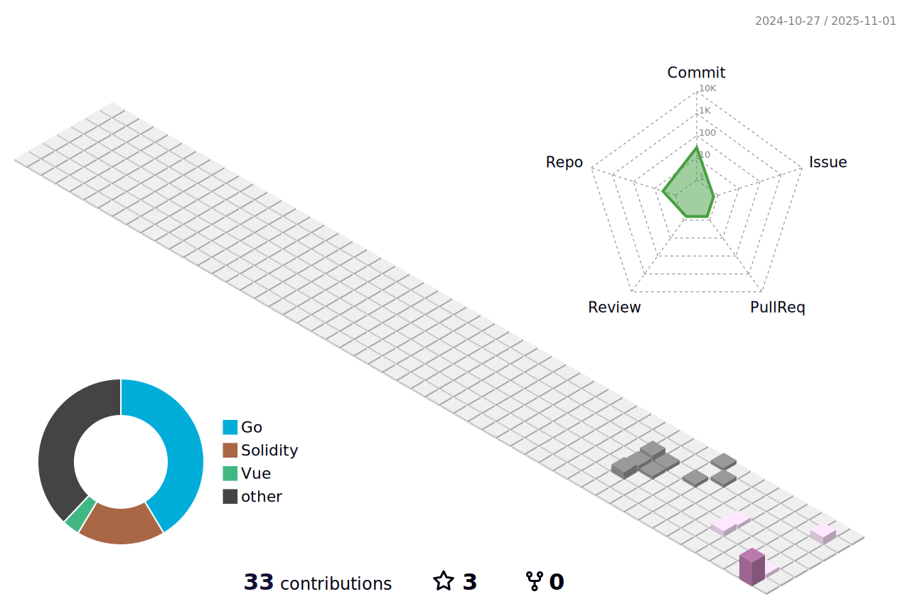

<!-- 开篇标语 -->
<div align="center">

<a href="https://git.io/typing-svg"></a>
</div>
<p></p>

<!-- 社交网站-->
<div align="center">
    <!-- 小图标 -->
    <a href="https://gitee.com/harimasal"></a>&emsp;
    <a href="https://blog.csdn.net/qq_42130324"></a>&emsp; 
    <a href="https://x.com/vvM52utqdy74615"></a>&emsp;
    <a href="https://www.youtube.com/@Shinedward"></a>&emsp;
    <a href="https://space.bilibili.com/253739891"></a>&emsp;
    <!-- visitor -->
    &emsp;
</div>
<br>

<!-- 仓库数据动画 -->
<picture>
  <source media="(prefers-color-scheme: dark)" srcset="https://raw.githubusercontent.com/HarimaSal/HarimaSal/output/pacman-contribution-graph-dark.svg">
  <source media="(prefers-color-scheme: light)" srcset="https://raw.githubusercontent.com/HarimaSal/HarimaSal/output/pacman-contribution-graph.svg">
  
</picture>


### Hi, 👋~ About me

<table>
  <tbody>
    <tr>
  <td>

 <details><summary>(Click to expand) <em><b>I love connecting with different people</b> so if you want to <a href="https://x.com/vvM52utqdy74615" >say <b>"hi" </b></a>, <b>I'll be happy to meet you more!</b> : )</em></summary>
 
<!--my introduction start-->
    
- 🔭 仰望星空
- 🌱 脚踏实地
- 🤔 保持热诚
  1. Coding
  2. Enjoy Life
- ❤️ 花样代码、书法、乐器、动漫、骑行、阅读
- 💬 Be free to ask me about anything [here](https://github.com/HarimaSal/HarimaSal/issues).
 
---
</details>
  
  ✨ 站主目前为N岁的Java程序猿，也喜欢吃banana，进化攻城狮ing。该站存放本人的一些代码程序，顺便记录自己的随想心得。欢迎大家来和我讨论技术上的问题

```javascript
const harimaSal = {
    pronouns: "He" | "Him",
    code: ["Java", "JavaScript", "Python", "Vue", "SpringBoot"],
    askMeAbout: ["backend architecture", "microservices", "cloud-native solutions", "system design"
                , "payment systems integration"],
    technologies: {
        frontEnd: {
            js: ["Vue.js", "React"],
            css: ["Tailwind CSS", "Element UI", "Ant Design"],
        },
        backEnd: {
            java: ["SpringBoot", "Spring Cloud", "MyBatis"],
            python: ["FastAPI"],
            js: ["Node.js", "Express"],
        },
        mobileApp: {
            crossPlatform: ["UniApp"],
        },
        devOps: ["Docker", "Kubernetes", "Jenkins", "Nginx", "GitLab CI/CD"],
        cloudServices: {
            aliyun: ["ECS", "RDS", "OSS", "VPC"],
            aws: ["EC2", "S3", "Lambda"],
        },
        databases: ["MySQL", "PostgreSQL", "Redis", "Elasticsearch", "MongoDB"],
        misc: ["RESTful APIs", "Message Queues", "Distributed Systems", "Payment Gateway APIs"],
    },
    architecture: {
        backEnd: ["microservices", "event-driven", "domain-driven design"],
        system: ["high concurrency", "high availability", "distributed transactions"],
        devOps: ["CI/CD pipeline", "container orchestration"],
    },
    currentFocus: "Building scalable payment systems and exploring cloud-native architectures",
    funFact: "I automate everything I can – even my coffee machine is on a schedule!"
};
```
  </td>
</tr>
  </tbody>

</table>
<!--my introduction end -->

### 📈 GitHub 数据
<div align="center">
<!-- 最近活动 -->
<picture>
  <source media="(prefers-color-scheme: dark)" srcset="https://streak-stats.demolab.com?user=HarimaSal&theme=material-palenight" />
  <source media="(prefers-color-scheme: light)" srcset="https://streak-stats.demolab.com?user=HarimaSal&theme=shadow-green&mode=weekly" />
  
</picture>
    &emsp;&emsp;
<!-- hub 状态 -->
<picture>
  <source media="(prefers-color-scheme: dark)" srcset="https://github-readme-stats.vercel.app/api?username=HarimaSal&theme=blueberry&show_icons=truen" />
  <source media="(prefers-color-scheme: light)" srcset="https://github-immortality.vercel.app/api?username=HarimaSal" />
  
</picture>

 <!-- hub折线图 -->
 <picture>
  <source media="(prefers-color-scheme: dark)" srcset="https://github-readme-activity-graph.vercel.app/graph?username=HarimaSal&theme=tokyo-night" />
  <source media="(prefers-color-scheme: light)" srcset="https://github-readme-activity-graph.vercel.app/graph?username=HarimaSal&theme=minimal" />
  
</picture>
  
</div>
<br>

<!-- 3d效果图 -->
<picture>
  <source media="(prefers-color-scheme: dark)" srcset="./profile-3d-contrib/profile-night-rainbow.svg" />
  <source media="(prefers-color-scheme: light)" srcset="./profile-3d-contrib/profile-south-season-animate.svg" />
  
</picture>


<hr>
<div align="left">
  
  
  
  
  
  
  
  
  
  
  
  
  
  
  
  
  
  
  
  
  
  
  
  
  
  
  
  
  
  
  
  
  
  
  
  
  
  
  
  
  
  
  
  
  
  
  
  
  
  
  
  
  
  
  
  
  
  
  
  
  
  
  
  
  
  
  
  
  
  
  
  
  
  
  
  
  
  
  
  
  
  
  
  
  
  
  
  
  
  
  
</div>

###
